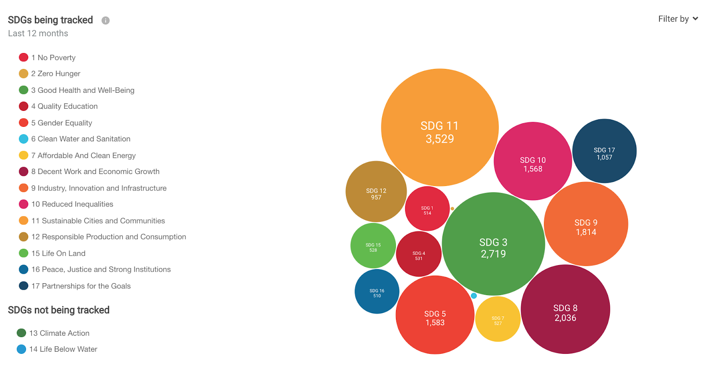
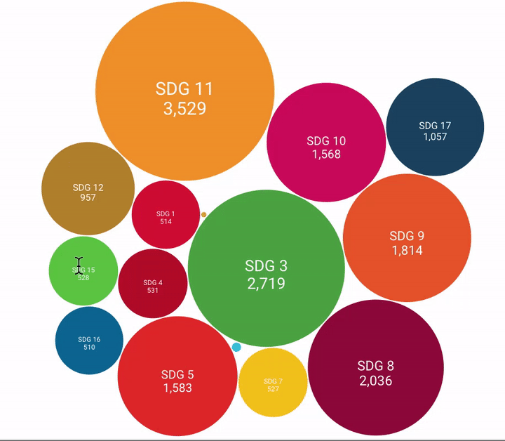
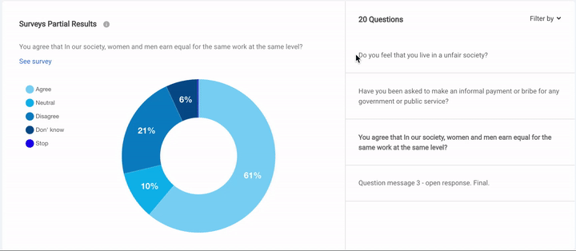
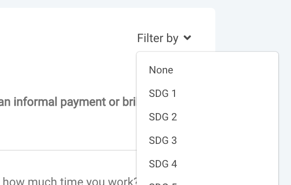
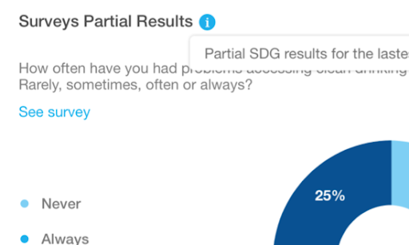
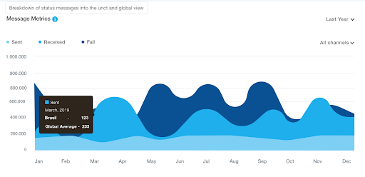
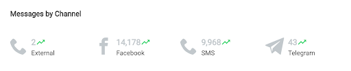

===============
Local Dashboard
===============
The main dashboard will bring to the user the possibility to analyse the data gathered from surveys.
It is the main access point for the user to gather perceptions from ongoing surveys and useful RapidPro data metrics.

Understanding SDGs Tracking
---------------------------
The bubble graph is where the user can see which SDG is being more tracked related to others.
In other words, it shows the numbers of received messages from questions that are linked to the respective SDG.

There are two separate sections to display the SDGs tracking status. The order doesn't interfere on the bubble size, it is ordered by crescent numerical order.
To provide a better readability there is a tooltip on each bubble displaying the SDG name and also the received messages count.

Survey partial results
----------------------
To follow ongoing surveys and track how the answers are being structured as the answers come from RapidPro,
the partial results graph shows from these surveys 20 questions in a random perspective. It will bring a more close approach to ongoing surveys.

There is a filter by SDG on the upper right corner, it allows the user to list questions which are linked to the selected SDG.
By navigating through the questions the user can get indicators from ongoing answers to each question.

In this graph the user can also navigate to the question correspondent survey by clicking on See Survey link (as described on the image below).

Tracking RapidPro messages traffic
----------------------------------
RapidPro register message traffic information. This information reflects the ongoing and finished surveys level of engagement.
This dashboard module shows the sum of aggregated values from sent and received messages.

These messages statistics board displays the tracking of the active channels on the organization on RapidPro.

The message metrics by channel  board displays the sum of all sent and received messages for a general overview of all channels and their usage status.

Tracking RapidPro contacts growth
---------------------------------
The number of contacts is a very important information provided from RapidPro.
It can be used to show the workspace's contact level of growth. The graph allows users to see this information from the last 6 months.

.. figure::  _images/rapidpro-charts.png
   :align:   center

The second graph (right) shows the amount of contacts from the user UNCT and the global average.
