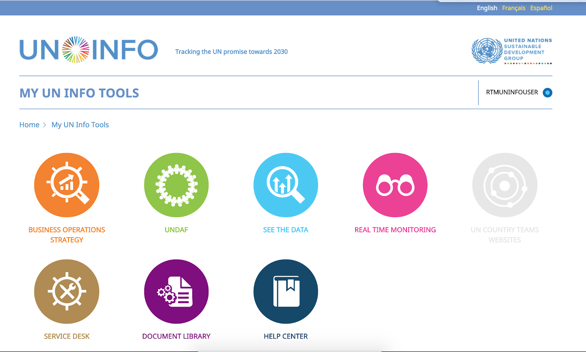

=============
UN INFO Login
=============

How to login on the platform
----------------------------
Today, the only way to login in RTM platform is through a UN Info access.
Only users with valid credentials on UN Info can access the module. To do that, you just need to go on "My UN Info Tools" tab.
If you have access to more than a UNCT, you need to specify which country you want to see first, and then you will be redirected to RTM.

How the system deals with first logins
--------------------------------------
On your first login, you'll receive the "viewer" user access permission.
As a "viewer", you can only see the UNCT Dashboard, surveys results and access the repository as well.
If you want a new user access, an UNCT administrator user need to change your access.

