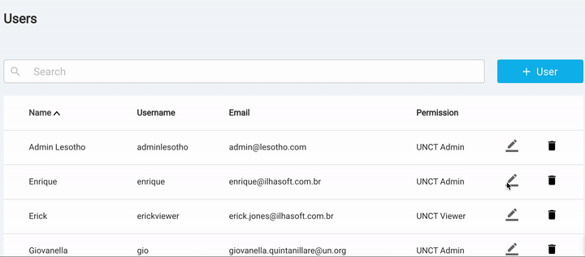

=====
Users
=====

Setting up users permission
---------------------------
Global and UNCT administrators can manage user by accessing the **Users** menu on the top header.
This module allows administrators to edit permissions and also to deactivate users. There are 4 groups of users inside the platform:

* Global Administrators
* Global Viewers
* UNCT Administrators
* UNCT Viewers

Global administrators can see global data results and also manage other global users, aside this,
they can create UNCT administrators as well as UNCT viewers.

Edit user permission
^^^^^^^^^^^^^^^^^^^^
To edit user permissions you can go over the users list and choose a specific user to see details and display the permission group settings.

Blocking users
--------------
Besides the possibility of change user data and permissions, administrator users can block users from RTM.
If you get blocked from RTM, you lose the capacity to login in the module, but your UN Info access isn't affected.
Only an administrator user can unblock a user.
